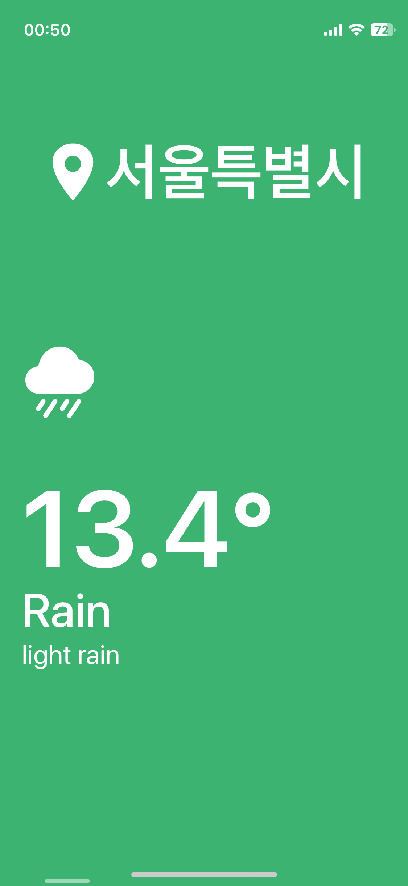
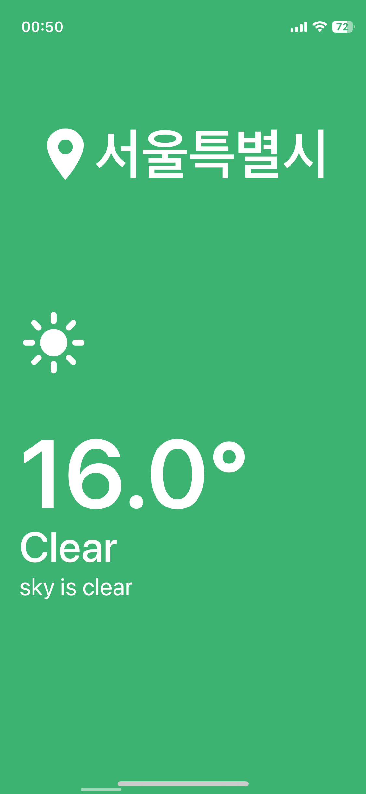

# Weather App 🌤️

A simple and clean weather app built with React Native and Expo.
It fetches real-time weather data based on the user’s current location.

## Features

-   Get current weather info (temperature, conditions, etc.)
-   Auto location detection using device GPS
-   Simple and intuitive UI

## Tech Stack

-   React Native
-   Expo
-   OpenWeather API
-   Location API (from expo-location)

## Screenshots





## Get started

1. Install dependencies

    ```bash
    npm install
    ```

2. Start the app

    ```bash
     npx expo start
    ```

Make sure you have the Expo Go app installed on your device to preview the app.
